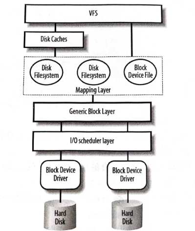

## 块设备驱动目标
以完成一个虚拟磁盘驱动为例，实现虚拟磁盘的驱动。
https://blog.csdn.net/qq_52479948/article/details/134393334

## 磁盘结构
磁盘盘片在旋转的过程中，磁头(Head)在盘片上的轨迹构成一个磁道(Trak),不同的盘片上同半径的磁道构成柱面(Cylinder),将柱面和磁道组合在一起构成磁盘。将一个磁道划分成多个小的扇形区域叫做扇区(Sector)。于是一个磁盘的容量可以通过下面公式计算：
`磁盘容量=磁头数 x 柱面数 x 每磁道的扇区数 x 每扇区的字节数`

## 块设备内核组件
当用户层发起对硬盘的访问操作时，将会涉及下图中的一些内核组件，现在将各个组件的大概作用描述如下。
- VFS (Virtual File System，虚拟文件系统):为应用程序提供统一的文件访问接口,屏蔽了各个具体文件系统的操作细节，是对所有文件系统的一个抽象。
- Disk Caches: 硬盘高速缓存，用于缓存最近访问的文件数据，如果能在高速缓存中找到，就不必去访问硬盘，毕竟硬盘的访问速度要慢很多。
- Disk Filesystem:文件系统，属于映射层(Mapping Layer)。在应用程序开发者的眼一个文件是线性存储的，但实际上它们很有可能是分散存放在硬盘的不同扇区上的.中，文件系统最主要的作用就是要把对文件从某个位置开始的若干个字节访问转换为对磁盘上某些扇区的访问。它是文件在应用层的逻辑视图到磁盘上的物理视图的一个映射。
- Generic Block Layer: 通用块层，用于启动具体的块 IO 操作的层。它是对具体硬盘设备的抽象，使得内核的上层不用关心磁盘硬件上的细节信息。
- I/O Scheduler Layer: I/O 调度层，负责将通用块层的块 IO 操作进行调度、排序和合并操作，使对硬盘的访问更高效。这在后面还会进一步进行说明。
- Block Device Driver: 块设备驱动，也就是块设备驱动开发者写的驱动程序，是我们接下来讨论的话题。



## 块设备驱动核心数据结构和函数
和字符设备一样，块设备也有主次设备号，只是次设备号对应的是块设备的不同分区。相关的函数如下。
```c
int register_blkdev(unsigned int major, const char *name);
void unregister_blkdev(unsigned int major, const char *name);
```
由于块设备的内核的其他组件完成了很多功能，所以块设备驱动基本不需要关心像struct block_device 这样的结构了。驱动开发者更关心的是一个硬盘的整体抽象，内核用struct gendisk 结构来表示，其中需要驱动开发者初始化的成员如下。
```c
struct gendisk {
    int major;
    int first_minor;
    int minors;
    char disk_name[DISK_NAME_LEN];
    const struct block_device_operations *fops;
    struct request_queue *queue;
    void *private_data;
......
};
```
major:主设备号，赋值为注册成功的主设备号。
first_minor:第一个次设备号，通常赋值为 0，磁盘的设备号为注册的主设备号和0,其他分区的次设备号逐个递增。
minors: 次设备号的最大值，因为次设备号通常从0开始，所以也表示块设备最大的分区数。该值被设定后不能再修改。
disk_name: 块设备的名字，如 sda、mmcblk0 等。内核会自动在该名字后追加次设备号作为次设备的名字，如 sda1、mmcblk0p1 等。
private_data: 块设备驱动可以使用该成员保存指向其内部数据的指针。
queue: 请求队列，这个会在后面详细介绍。
fops: 块设备的操作方法集，和字符设备驱动一样，该结构中是一些函数指针，主要成员如下。

```c
struct block_device_operations {
    int (*open) (struct block_device *, fmode_t);
    void (*release) (struct gendisk *, fmode_t);
    int (*ioctl) (struct block_device *, fmode_t, unsigned, unsigned long);
    int (*media_changed) (struct gendisk *);
    int (*revalidate_disk) (struct gendisk *);
    int (*getgeo)(struct block_device *,struct hd_geometry *);
......
};
```
open: 打开块设备时调用，比如用于开始旋转光盘，准备之后的读写操作
release:关闭块设备时调用。
ioctl: 用于完成一些控制操作，但是对块设备的控制很大一部分都被上层的内核组件先截获并处理了，所以在块设备驱动中该函数几乎什么都不用做。
media_changed;用于检测可移动设备的介质是否被更换，如果更换了返回一个非 0值。如果不是可移动设备，该函数不用实现。
revalidate_disk;当介质被更换时，上层内核组件调用该函数，使驱动有机会对设备重新进行一些初始化操作。
getgeo: 向上层返回一些块设备的几何结构信息，如磁头数、柱面数、总的扇区数等。
格式化的软件会用到这些参数，如前面提到的 fdisk。和字符设备不同的是，在操作方法集合中并没有包含与读、写相关的操作，实际上这些操作是通过请求队列和与之绑定的请求处理函数来完成的，后面我们会详细谈到这一点。
