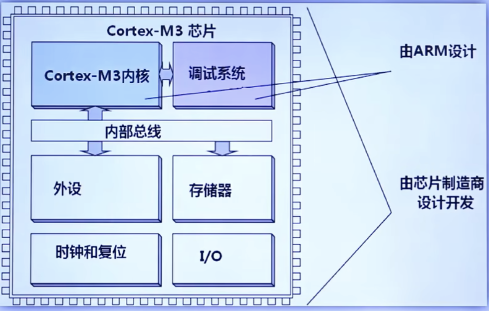
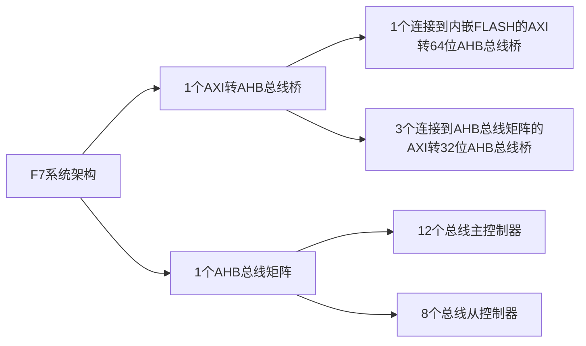
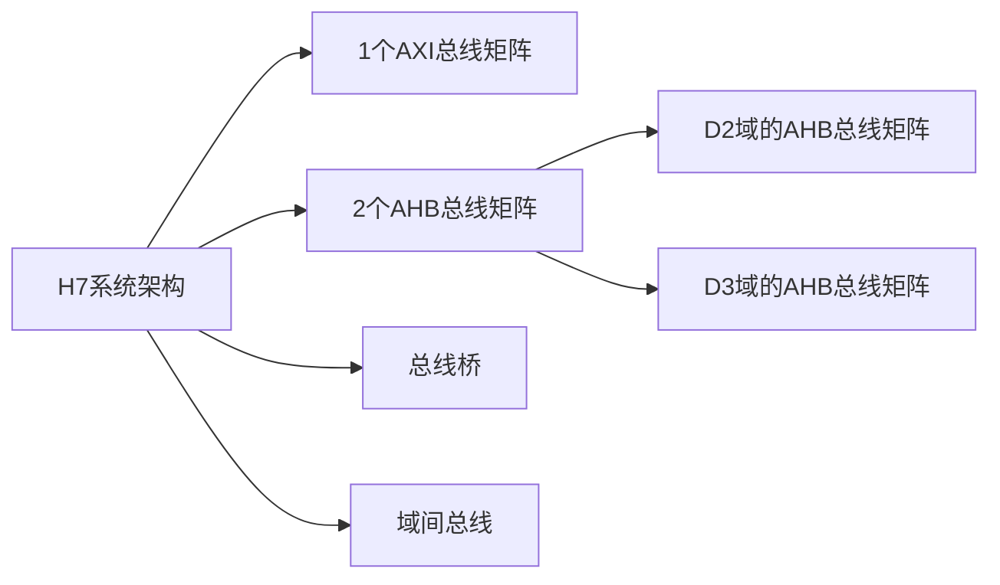

## 内核与芯片的关系
芯片中的Cortex- M3内核（或其他内核）以及内嵌于其中的调试系统是有ARM公司设计，并授权给各MCU厂商的。各MCU厂商会根据芯片的硬件特性，对内核进行修改，并添加一些新的功能，再添加各种外设、存储器、时钟和复位及IO等硬件功能，再加上外部封装，就构成了一个芯片。

 { width=50% }

## STM32F10x系列系统架构
4个主动单元+4个被动单元
|主动单元|被动单元|
|:---:|:---:|:---:|
|Cortex M3内核DCode总线(D-Bus)|内部FLASH|
|Cortex M3内核系统总线(S-Bus)|内部SRAM|
|通用DMA1|FSMC|
|通用DMA2|AHB到APB的桥，它链接所有的APB外设|
|以太网DMA||
对于互联型STM32芯片，还有一个主动单元以太网DMA，用于ETHERNET。  

AHB：高级高性能总线
APB：高级外围总线
SDIO: SD卡控制器
FSMC: 外置存储器控制器

简图如下：

ICode总线直接链接Flash接口，不需要经过总线矩阵。

CrotexM3内核频率72MHz.

总线时钟频率：
AHB：72MHz(Max)
APB1: 36MHz(Max)
APB2: 72MHz(Max)

## STM32F40x系列系统结构
包含8个主动总线+8个被动总线
|主动单元|被动单元|
|:---:|:---:|
|Cortex M4内核D总线(D-Bus)|内部FLASH DCode总线|
|Cortex M4内核I总线(I-Bus)|内部FLASH ICode总线|
|Cortex M4内核S总线(S-Bus)|内部SRAM1(112KB)|
|DMA1存储器总线|辅助内部SRAM2(16KB)|
|DMA2存储器总线|内部SRAM3(64KB),适用于F42xx，F43xx, F44xx, F46xx, F47xx, F49xx|
|DMA2外设总线|AHB1外设(包括AHB-APB总线桥和APB外设)|
|以太网DMA总线|AHB2外设|
|USB OTG HS DMA总线|FSMC外设|

简图如下：

CCM RAM：只能存数据，优点访问速度快，缺点不支持DMA.
DCode总线直接链接CCM RAM接口，不需要经过总线矩阵。

总线时钟频率：
AHB1/2: 168/180MHz(Max)
APB1: 42/45MHz(Max)
APB2: 84/90MHz(Max)

## STM32F7xx系列系统结构

|总线主控制器|总线从控制器| 
|:---:|:---:|
|3x32位AHB总线|AHB总线上的内嵌Flash|
|连接到内嵌Flash的64位AHB总线|Cortex M7 AHBS从接口(仅用于DTCM RAM的DMA数据传输)|
|AHBP总线|主SRAM1(240KB)|
|DMA1存储器总线|辅助SRAM2(16KB)|
|DMA2存储器总线|AHB1外设(包括AHB-APB总线桥和APB外设)|
|DMA2外设总线|AHB2外设(包括AHB-APB总线桥和APB外设)|
|以太网DMA总线|FMC外设|
|USB OTG HS DMA总线|Quad SPI外设|
|LCD控制器DMA总线||
|DMA2D存储器总线||

F7系统架构简图如下：

DTCM RAM: 只能存数据，也可访问数据。优点访问速度快，缺点不支持DMA.    
ITCM RAM: 存指令（程序）。支持CPU时钟速度访问，0个等待周期。

总线时钟频率：
AHB1/2: 216MHz(Max)
APB1: 54MHz(Max)
APB2: 108MHz(Max)

## STM32H7xx系列系统结构

ITCM RAM: 存指令（程序）。支持CPU时钟速度访问，0个等待周期。
DTCM RAM: 存数据。支持CPU时钟速度访问，0个等待周期。

总线时钟频率：
AHB1/2/3/4: 240MHz(Max)
APB1/2/3/4: 120MHz(Max)

